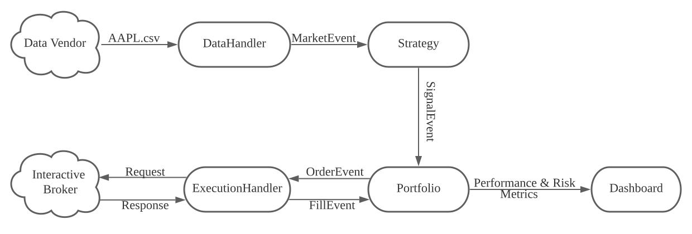

# Project Proposal - 10/10/2021

*Chuang Yao, Jianqi Zhu, Kongjun Qin.*

We will be developing a basic event-driven backtesting library (HackTest) as the course project for OOP I. HackTest will
be a library inspired
by [a series of articles](https://www.quantstart.com/articles/Event-Driven-Backtesting-with-Python-Part-I/)
on [QuantStart](https://quantstart.com/) about event-driven backtesting with Python. It will be written in C++ with the
following in mind:

- object-oriented approach & code reusability
- supporting different order types
- realistic emulation of market transactions
- capable of handling real-time market data
- live metrics of performance and risk management

The library will likely function as illustrated bellow:



For now, we will focus on backtesting with historical data. We assume price data have already been downloaded from data
vendors as CSV files. However, this framework should be easily adapted to a live trading environment.

Based on the downloaded market data, `DataHandler` will emit a `MarketEvent` object to the `Strategy`
object.The `Strategy` class is implemented by library users and can be customized to support different trading
strategies, from momentum-based ones to machine learning. Upon receiving the `MarketEvent`, it will process the data and
emit a `SignalEvent` to `Portfolio` with instructions on how to adjust current positions. Then `Portfolio` will send
an `OrderEvent` to `ExecutionHandler` on what to buy and what to sell. `ExecutionHandler` will talk to an actual or a
simulated interactive broker. `FillEvent` contains feedback from the broker to the `Portfolio` about the details of
orders executed, such as price filled and transaction costs. The `Dashboard` will be updated with real-time performance
and risk management metrics.

# Midway Report - 11/10/2021

*Chuang Yao, Jianqi Zhu, Kongjun Qin.*

We have finished all Event classes and the DataHandler classes in the diagram above. As of now, the library is capable
of

- generating event objects
- adding event objects to an event queue
- reading historical stock prices from csv files into the memory
- querying the price data stored in the memory and writing to the standard output

Existing functionalities are tested in `examples/test.cpp`. Output of the program is shown below:

```
C:\Users\chuan\CLionProjects\HackTest\cmake-build-debug\examples\test.exe
Hello, from HackTest!
MARKET  Wed Nov 10 23:57:44 2021
SIGNAL  Wed Nov 10 23:57:44 2021
ORDER   Wed Nov 10 23:57:44 2021
FILL    Wed Nov 10 23:57:44 2021
No data for AMD on 2019-06-13
Showing data for AAPL on 2019-06-13
2019-06-13      48.675  49.1975 48.4    48.5375 47.5034 86698400
No data for AAPL on 2021-06-13
Showing data for MSFT on 2019-06-13
2019-06-13      131.98  133     131.56  132.32  129.211 17200800
No data for MSFT on 2021-06-13
Showing the latest 5 entries for AAPL
2021-11-09      150.2   151.43  150.06  150.81  150.81  56787900
2021-11-08      151.41  151.57  150.16  150.44  150.44  55020900
2021-11-05      151.89  152.2   150.06  151.28  151.28  65414600
2021-11-04      151.58  152.43  150.64  150.96  150.74  60394600
2021-11-03      150.39  151.97  149.82  151.49  151.269 54511500
Showing the latest 5 entries for MSFT
2021-11-09      337.11  338.72  334.53  335.95  335.95  21307400
2021-11-08      337.3   337.65  334.44  336.99  336.99  20897000
2021-11-05      338.51  338.79  334.42  336.06  336.06  22564000
2021-11-04      332.89  336.54  329.51  336.44  336.44  23992200
2021-11-03      333.9   334.9   330.65  334     334     21500100

Process finished with exit code 0
```

The program is tested with gcc-11.2 on Windows and gcc-9.2 on Ubuntu 20.04. It may not compile on some versions of macOS
due to its usage of `std::filesystem`.

We will continue to work on the remaining components such as the Portfolio and ExecutionHandler. Hopefully by the end of
the semester, we can have a working demo of backtesting a simple trading strategy on AAPL and MSFT.

# Final Report - 12/07/2021

We have finished implementing the remaining core components of `HackTest`, including `Strategy`,`Portfolio`
, `ExecutionHandler`, and some helper functions for measuring portfolio performance. The library is now capable for
backtesting basic equity-based strategies.

```
/Users/cyao/Developer/CLionProjects/HackTest/cmake-build-debug/examples/HackTest
Handling MarketEvent...
The event queue is now empty! Sleep for 1ms...
Date: 2021-01-04	Portfolio Value: $1000000.00

Handling MarketEvent...
Handling SignalEvent...
Handling SignalEvent...
Handling OrderEvent...
Handling OrderEvent...
Handling FillEvent...
Handling FillEvent...
The event queue is now empty! Sleep for 1ms...
Date: 2021-01-04	Portfolio Value: $1000000.00

Handling MarketEvent...
Handling SignalEvent...
Handling SignalEvent...
The event queue is now empty! Sleep for 1ms...
Date: 2021-01-05	Portfolio Value: $1000179.84

...

Handling MarketEvent...
Handling SignalEvent...
Handling SignalEvent...
The event queue is now empty! Sleep for 1ms...
Date: 2021-12-02	Portfolio Value: $1014875.25

Handling MarketEvent...
Handling SignalEvent...
Handling SignalEvent...
The event queue is now empty! Sleep for 1ms...
Date: 2021-12-03	Portfolio Value: $1014035.25
```

There is much to be improved. We are looking at the following potential improvements:

- implement a `pandas`-style dataframe class that stores pricing data in contiguous memory for faster and easier access.
- make the event-handling mechanics asynchronous.
- supporting more complicated trading strategies.
- try to hook the system up with real-time data and see if it works.
